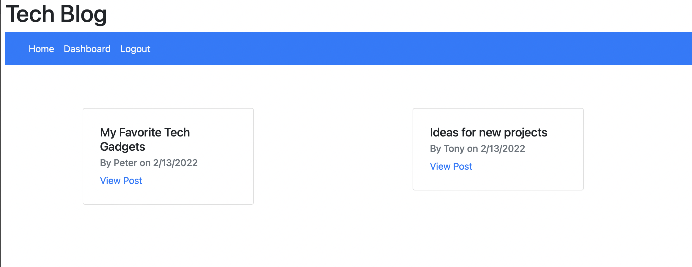
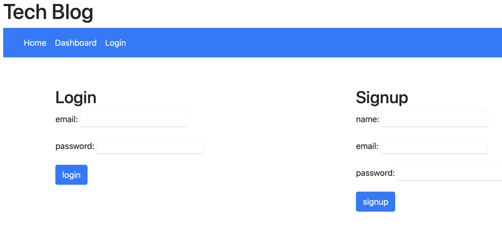
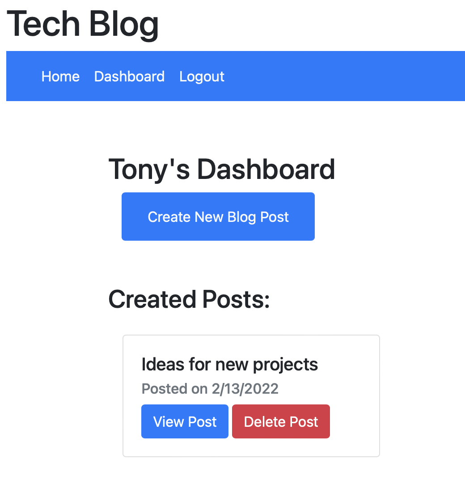
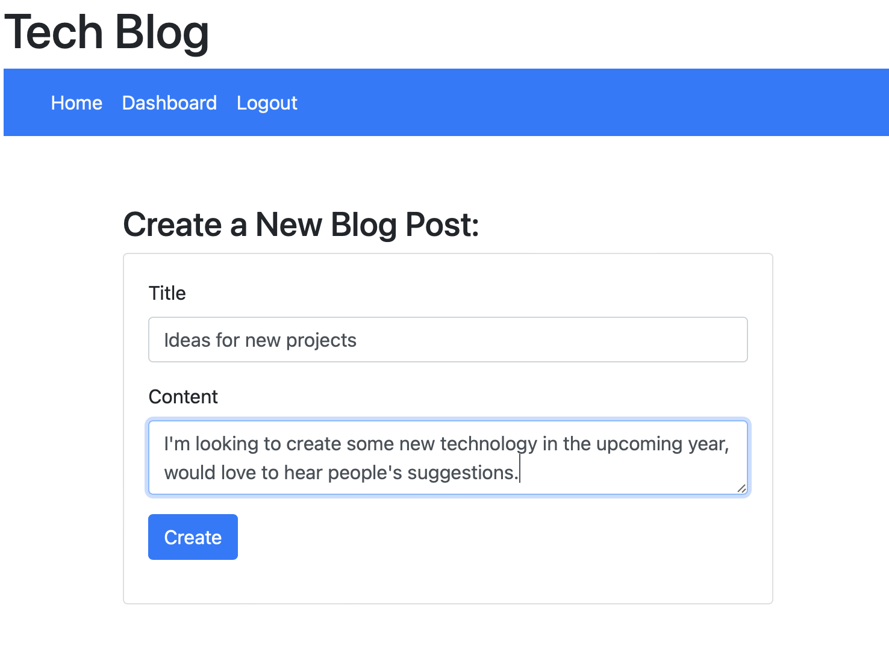
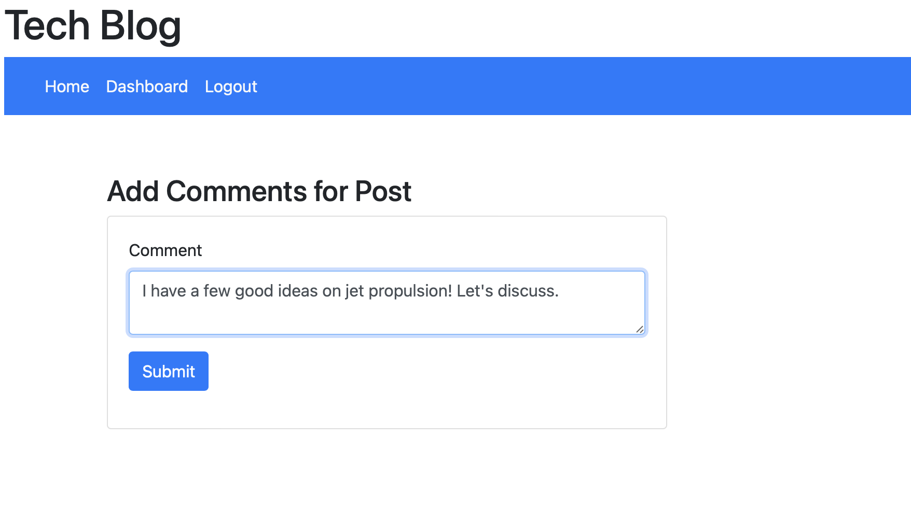
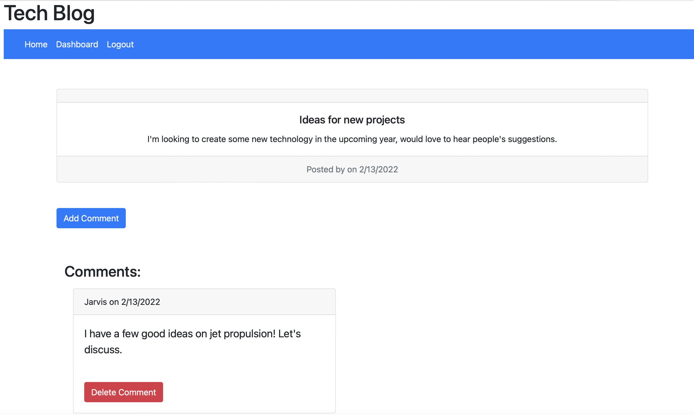

# TechBlog


## Description
Blog application for users to create content and collaborae with others through comments.

Highlights for this project:
- Developed using Node.js, Express, MySQL2 and Sequelize
- Use of Handlebars.js as the templating language
- Demonstration of Model-View-Controller paradigm. 
- Sequelize as the ORM
- Express-session npm package for authentication

## Table of Contents
- [User Story](#user-story)
- [Installation](#installation)
- [Usage](#usage)
- [License](#license)
- [Contributing](#contributing)
- [Tests](#tests)
- [Deployed Application](#deployed-application)
- [Questions](#questions)

## User-Story

```md
AS A developer who writes about tech
I WANT a CMS-style blog site
SO THAT I can publish articles, blog posts, and my thoughts and opinions
```
## Installation
To use this code as your own you will need to install Node.js and install NPM package dependencies. Also, configure a .env file to hold your database connection details (database name, password, user information).

Consider creating .gitignore file and include .env file node_modules so that your information is not tracked or uploaded to a repository in the future. Be sure to create your. .gitignore file before installing any npm dependencies.


## Usage
When the application initially loads, users will be presented with a homepage with current blog posts.  In order to view the details of the blog posts or perform any further actions, the user will be prompted to sign up or log in.



The user will be able to login to the with existing details or create a new user.  Once doing so, a session will be created for the user.  If the user is idle on the site for a period of time, the cookie will expire and the user will be required to log in again to start a new session. 



Once logged in, a user will have access to their own dashboard and can view their current posts and delete any if desired.



A user can also create a new post from their dashboard page. 



Alternatively, a user can view posts and add their own comments.




## License
This application is covered under the [License: MIT](https://opensource.org/licenses/MIT).


## Contributing
Resources from this project:
- Node.js
- Boostrap
- Express
- Handlebars
- MySQL2
- Sequelize
- Bcrypt
- Deployed on Heroku


## Tests
No test scripts for this application.


## Deployed Application
[Checkout the live application](https://warm-plateau-22528.herokuapp.com)

## Questions
Contact Details:

- GitHub profile: [mel-ificent](https://github.com/mel-ificent)
- For additional questions, you can contact me via email: melissadonato11@gmail.com